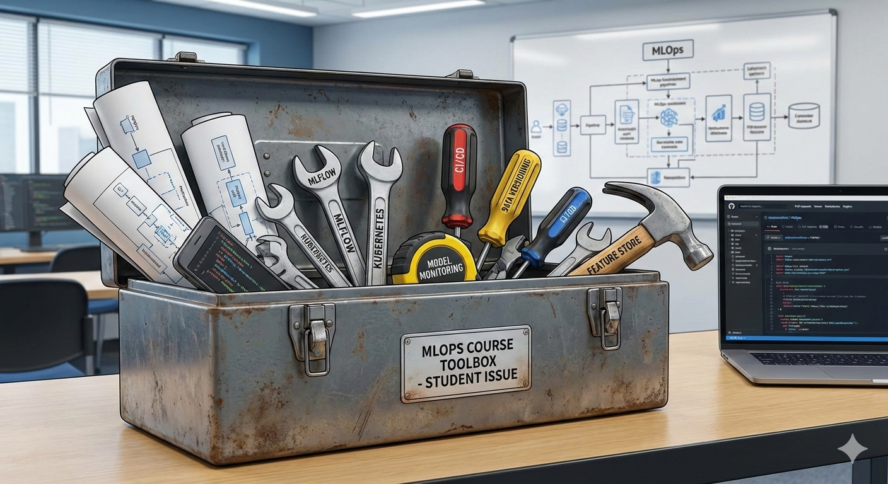

# Introduction

First of all, welcome to the course *Machine Learning Operations* (MLOps)! This repository contains all the material
for the course, including lecture notes, exercises, and additional references. I am not going to promise that you will
be an expert in MLOps after this course, however, I do promise that you will now know the fundamental concepts and many
tools that are used in the field. I very much see this course as a toolbox which is filled up with many different tools
throughout the course which you then pick from when you need them in the future.

<figure markdown>
{ width="1000" }
<figcaption>
This course is a toolbox. You will not become an expert in every tool presented here, but you will get
an overview of many of the tools that are used in MLOps, and you will be able to pick up new tools as needed in the
future. AI generated image by Gemini AI Nano Banana Pro.
</figcaption>
</figure>

## 🆒 MLOps: What is it?

*Machine Learning Operations* (MLOps) is a rather new field that has seen its uprise as machine learning and
particularly deep learning has become a widely available technology. The term itself is a compound of "machine learning"
and "operations" and covers everything that has to do with the management of the production ML lifecycle. At its core,
MLOps is creating structures and processes that allows you to go from doing developing a machine learning model once on
your laptop to having a robust and scalable system that can be used by many users in production.

> An analogy is the difference between you cooking a meal for yourself at home versus running a restaurant. In the first
> case, you can just throw something together with whatever you have in your fridge. In the second case, you need to
> have a well-defined process for how to source ingredients, prepare the food, serve it to customers, and make sure that
> everything is running smoothly. MLOps is about creating the "restaurant" for machine learning models.

The lifecycle of production ML can largely be divided into three phases:

1. Design: The initial phase starts with an investigation of the problem. Based on this analysis, several requirements
    can be prioritized for what we want our future model to do. Since machine learning requires
    data to be trained, we also investigate in this step what data we have and if we need to source it in some other
    way.

2. Model development: Based on the design phase we can begin to conjure some machine learning algorithms to solve our
    problems. As always, the initial step often involves doing some data analysis to make sure that our model is
    learning the signal that we want it to learn. Secondly, is the machine learning engineering phase, where the
    particular model architecture is chosen. Finally, we also need to do validation and testing to make sure that
    our model is generalizing well.

3. Operations: Based on the model development phase, we now have a model that we want to use. The operations are where
    we create an automatic pipeline that makes sure that whenever we make changes to our codebase they get automatically
    incorporated into our model, such that we do not slow down production. Equally important is the ongoing monitoring
    of already deployed models to make sure that they behave exactly as we specified them.

It is important to note that the three steps are a *cycle*, meaning that when you have successfully deployed a
machine learning model that is not the end of it. Your initial requirements may change, forcing you to revisit the
design phase. Some new algorithms may show promising results, so you revisit the model development phase to implement
this. Finally, you may try to cut the cost of running your model in production, making you revisit the operations phase,
and trying to optimize some steps.

The focus of this course is particularly on the **Operations** part of MLOps as this is what many data scientists are
missing in their toolbox to implement all the knowledge they have about data processing and model development into a
production setting.

## 💻 Course setup

Start by creating an overall folder on your local machine where you will keep all the material for this course.

```txt
<02476_XXX>/  # call this whatever you like
    └── ...
```

Inside this folder you should clone this repository:

```bash
git clone https://github.com/SkafteNicki/dtu_mlops
```

If you do not have git installed yet on your machine, it is okay to simply download the ZIP file from
[this page](https://github.com/SkafteNicki/dtu_mlops/archive/refs/heads/main.zip) and unzip it inside the folder you
created above (for now). Do not worry, we will touch on git during day 2 of the course. There is a good chance that
during the course I will update some material, so make it a habit to run `git pull` from time to time to get the latest
updates.

## 📢 Communication

The course has a dedicated
[Slack channel](https://join.slack.com/t/dtumlops/shared_invite/zt-3mgdtd0hw-TXmrOk35_vOFTQvpXb3OWA)
which we use for communication. All course announcements will be shared in the `#general` channel, and we have
dedicated channels for asking questions about each session, e.g. `#s1`, `#s2`, etc. You are highly encouraged to ask
questions there, because often other students have the same questions. At least check it once a day to see if there are
any updates.

The link may be expired, write to [me](mailto:nsde@dtu.dk) to get a new invite link if
needed. Note that the Slack channel is really only active during January when the course runs.

## 📂 Course organization

We highly recommend that when going through the material you use the
[homepage](https://skaftenicki.github.io/dtu_mlops/) which is the corresponding
[GitHub Pages](https://pages.github.com/) version of this repository that is more nicely rendered, and also includes
some special HTML magic provided by
[Material for MkDocs](https://squidfunk.github.io/mkdocs-material/).

The course is divided into sessions, denoted by capital **S**, and modules, denoted by capital **M**. A session
corresponds to a full day of work if you are following the course, meaning approximately 9 hours of work. Each session
(**S**) corresponds to a topic within MLOps and consists of multiple modules (**M**) that each cover a specific topic.

Importantly we differ between core modules and optional modules. Core modules will be marked by

!!! info "Core Module"

at the top of their corresponding page. Core modules are important to go through to be able to pass the course.
You are highly recommended to still do the optional modules.

Additionally, be aware of the following icons throughout the course material:

* This icon can be expanded to show code belonging to a given exercise

    ??? example

        I will contain some code for an exercise.

* This icon can be expanded to show a solution for a given exercise

    ??? success "Solution"

        I will present a solution to the exercise.

* This icon (1) can be expanded to show a hint or a note for a given exercise
    { .annotate }

    1. :man_raising_hand: I am a hint or note

# 🏗️ Recommended folder structure

The course involves working on several exercises and projects. To keep your work organized and avoid dependency
conflicts, it is advisable to maintain a clear folder structure with separate virtual environments for each part of the
course. The following structure is recommended:

```txt
<02476_XXX>/                        # call this whatever you like
    ├── dtu_mlops/                  # the content of this repository
    │   ├── .git/
    │   ├── .venv/
    │   ├── uv.lock
    │   ├── pyproject.toml
    │   └── ...
    ├── <template-project>/         # this project will be created on day 2
    │   ├── .git/
    │   ├── .venv/
    │   ├── uv.lock
    │   ├── pyproject.toml
    │   └── ...
    ├── exercises/                  # folder for all other exercises
    │   ├── .git/
    │   ├── exercise_s<X1>_m<Y1>/   # exercise for session X1, module Y1
    │   │   └── ...
    │   ├── exercise_s<X2>_m<Y2>/   # exercise for session X2, module Y2
    │   │   └── ...
    │   ├── .venv/
    │   ├── uv.lock
    │   ├── pyproject.toml
    │   └── ...
    | ── <exam-project>/            # your exam project will be created on day 5
    │   ├── .git/
    │   ├── .venv/
    │   ├── uv.lock
    │   ├── pyproject.toml
    │   └── ...
    └── ...                         # other notes/files related to the course
```

Use this as a reference layout as you go through the course e.g. you do not have to understand what `uv.lock` and
`pyproject.toml` are right now. The important points are:

* The `dtu_mlops/` folder contains the content of this repository.

* The `<template-project>/` folder contains the cookiecutter template project that you will create on day 2 of the
    course. This will be a running example throughout the course when working on the exercises.

* The `exercises/` folder contains one-off exercises that you will work on during the course. Each exercise should
    ideally be in its own folder, named according to the session and module it belongs to.

* The `<exam-project>/` folder will contain your exam project that you will create on day 5 of the course.

Here the `<>` indicates that you can name the folders as you like. Please do not use spaces in the folder names, as this
can sometimes lead to issues when working with command line tools. The core point about doing so is keep your work
separated into different virtual environments. This way, you can avoid dependency conflicts between the different parts
of this course. Additionally, we recommend making each sub-folder a git repository on its own.

If you need example code, exercise files or solutions from the course repository (the `dtu_mlops/` folder) you can
simply copy them over into the relevant project folder.
